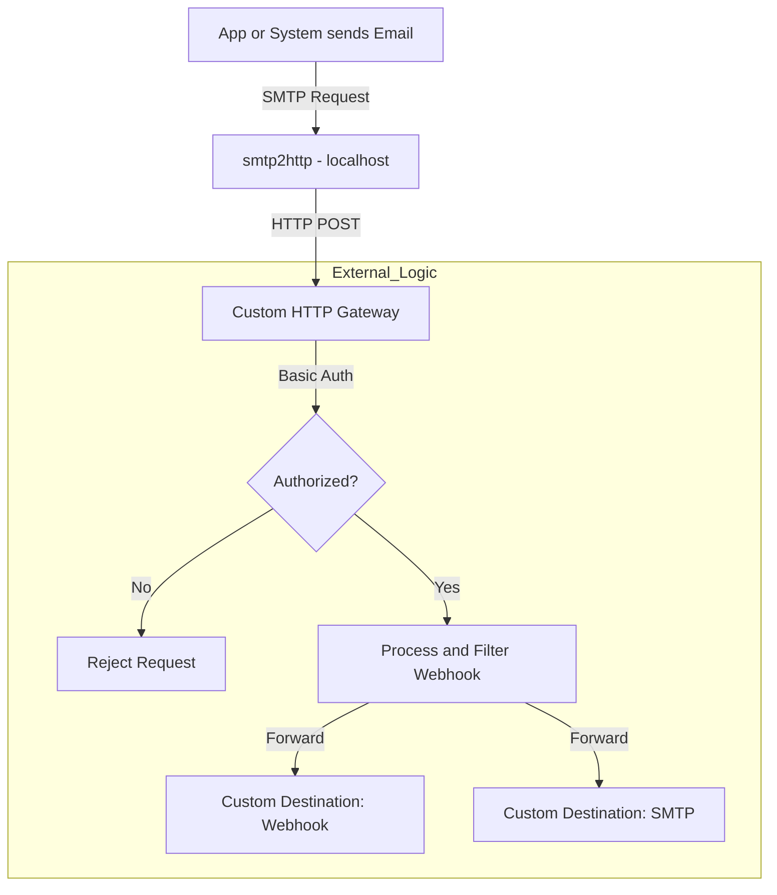

# SMTP2HTTP (email-to-web)

Originally started as a fork of [alash3al/smtp2http](https://github.com/alash3al/smtp2http).

smtp2http is a simple smtp server that resends the incoming email to the configured web endpoint (webhook) as a basic http post request.

## Usage

```text
Usage of ./smtp2http:
  -base64html
        encode HTML body in base64 (default: false) for webhook
  -compressbase64
      compress the base64 HTML body (default: false) for webhook
  -domain string
        domain for recieving mails
  -listen string
        the smtp address to listen on (default ":smtp")
  -msglimit int
        maximum incoming message size (default 2097152)
  -name string
        the server name (default "smtp2http")
  -pass string
        pass for smtp client
  -timeout.read int
        the read timeout in seconds (default 5)
  -timeout.write int
        the write timeout in seconds (default 5)
  -user string
        user for smtp client
  -webhook string
        the webhook to send the data to (default "http://localhost:8080/my/webhook")
```

## Development

- `go mod vendor`
- `go build`

### Development with Docker (docker compose)

To run the development version of smtp2http using Docker, you can use the provided Dockerfile and docker-compose setup.

```shell
# Start the container
docker compose up -d

# Enter the container shell
docker compose exec dev sh

# Run commands and start developing.
# Once inside the container, you can run:

go mod vendor

# Build the application
GOOS=linux go build -mod vendor -a -o smtp2http .

# Run the application
chmod +x ./start
./start 
# or run directly
./smtp2http --listen=:25 --webhook=http://localhost:8080/api/smtp-hook
```

The docker-compose.yml provided is for development purpose and mounts the current directory into the container, allowing you to edit files on your host machine and see changes reflected in the container.

### Dev with Docker

Using pre-built docker image:

```sh
docker pull ghcr.io/markterence/smtp2http:latest

docker run -p 25:25 ghcr.io/markterence/smtp2http:latest \ 
    --webhook=http://some.hook/api
```

Locally :
- `go mod vendor`
- `docker build -f Dockerfile.dev -t smtp2http-dev .`
- `docker run -p 25:25 smtp2http-dev --timeout.read=50 --timeout.write=50 --webhook=http://some.hook/api`

Or build it as it comes from the repo :
- `docker build -t smtp2http .`
- `docker run -p 25:25 smtp2http --timeout.read=50 --timeout.write=50 --webhook=http://some.hook/api`

The `timeout` options are of course optional but make it easier to test in local with `telnet localhost 25`
Here is a telnet example payload : 

```text
HELO zeus
# smtp answer

MAIL FROM:<email@from.com>
# smtp answer

RCPT TO:<youremail@example.com>
# smtp answer

DATA
your mail content
.
```

## Docker (pre-built image)

To use the pre-built Docker image of smtp2http, you can pull it from GitHub Container Registry (ghcr.io). Pre-built image are available and only on ghcr.

**docker-compose.yml** Example:

```yml
services:
  smtp2http:
    image: ghcr.io/markterence/smtp2http:latest
    container_name: smtp2http
    restart: unless-stopped
    ports:
      - "2525:25"
    env_file:
      - .env
    command: [
      "-listen=0.0.0.0:25",
      "-webhook=${WEBHOOK_URL}",
      "-user", "${SMTP_USER}",
      "-pass", "${SMTP_PASSWORD}",
      "-name", "smtp2http"
    ]
```

```text
# .env Example
WEBHOOK_URL=http://localhost:8080/api/smtp-hook
SMTP_USER=user_for_this_smtp
SMTP_PASSWORD=password_for_this_smtp
```

## Native usage

`smtp2http --listen=:25 --webhook=http://localhost:8080/api/smtp-hook`
`smtp2http --help`

## Differences from original repo

- Allowed multiple recipients. The `addresses.to` json field now contains an array of email addresses object.

```json
"addresses": {
    "from": {
      "address": "smtp2http@example.com"
    },
    "to": [
      {
        "address": "johndoe@example.com"
      },
      {
        "address": "janedoe@gmail.com"
      }
    ],
    "reply_to": [
      {
        "address": "johndoe@example.com"
      }
    ]
  }
```

- Added `base64html` option to encode HTML body in base64 for webhook.
- Added `compressbase64` option to compress the base64 HTML body.
- Outgoing POST request have HTTP Basic Auth for webhook authorization.
- Outgoing POST request can have additional query for webhook authorization.

## Use Case



This diagram illustrates an extensible email-to-webhook integration pipeline using smtp2http and custom gateway logic:

- An **App or System** sends an email using standard SMTP.
- The **smtp2http** (installed locally or somewhere and listening on localhost or private network for security ) receives the SMTP request and forwards it as an HTTP POST to a custom HTTP Gateway.
- The smtp2http also sends an HTTP Basic Authorization Header for the receiving systems to authenticate.
- The **Custom HTTP Gateway** is developer-maintained and serves as both receiver and arbiter. It requires basic authentication (user/password) from smtp2http.
- Upon receiving a webhook, the gateway checks authorization. If unauthorized, the request is rejected.
- If authorized, the gateway can process, filter, and transform the webhook data as needed.
- The processed webhook can then be routed to any custom destination, such as:
  - A different webhook endpoint (e.g., to trigger an external API or system)
  - An SMTP server (e.g., to relay or forward the email)

This approach keeps the smtp2http agent isolated and simple, while allowing for maximum flexibility and control on the developer’s side for handling, securing, and routing incoming email events.

## Contribution

Original repo from [@alash3al](https://github.com/alash3al) 

Thanks to [@aranajuan](https://github.com/aranajuan) and [@alash3al](http://github.com/alash3al)
